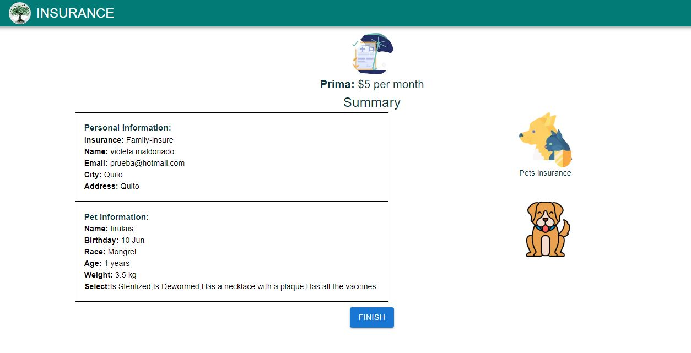

## Are forms important?
The collection and analysis of data is an essential part of a project, for which the use of forms is an important tool that allows the acquisition of relevant data.
There are some benefits of digital forms such as:
 - Save of time and money
 - Massive reach
 - Eliminate input errors and data loss
 - Flexibility to modify the form

## About this project
This project is a web page that displays a form in multiple steps, using the Formik library for the form and Yup for data validation. Different elements of a form are used, such as:
 - TextField
 - CheckBox
 - RadioButton
 - Switch
 - Selector
 - And Input a image

[](public/PageImage1.JPG)

[](public/PageImage2.JPG)

Finally, after the form, a summary of the data entered is displayed.
[](public/PageImage3.JPG)

Additionally, the form data is sent to a base in AirTable, to store them.

This project was coded using the next.js framework with Typescript. [DEMO](https://formik-in-step.vercel.app/)

## Clone the project 
```sh
git clone https://github.com/violeta-maldonado/Formik-in-step.git
```
## Packages
The following packages are used in this project:
- [Redux Toolkit](https://redux-toolkit.js.org/)
- [MUI5](https://mui.com/getting-started/installation/)
- [Next js](https://nextjs.org/docs)
- [Formik mui](https://github.com/stackworx/formik-mui)
- [Yup](https://www.npmjs.com/package/yup)


## Run the program

```sh
yarn dev
```

You can see the page in your local server http://localhost:3000

## License

[](http://badges.mit-license.org)

- This project is licensed under the terms of the **[MIT license](LICENSE)**